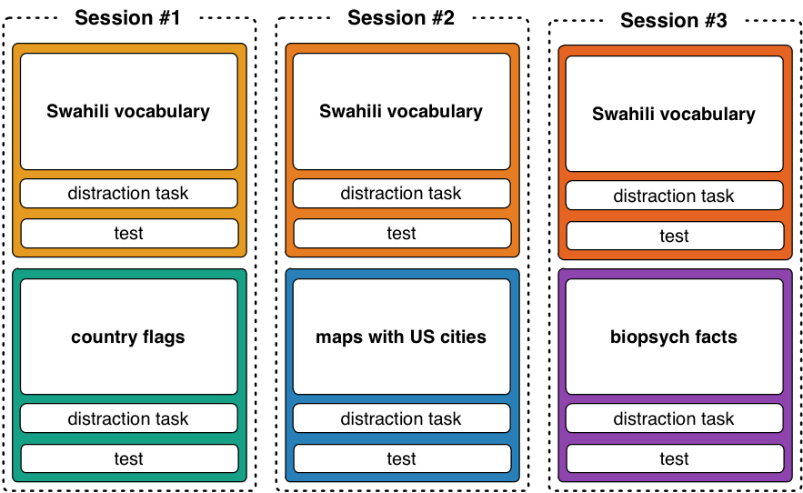
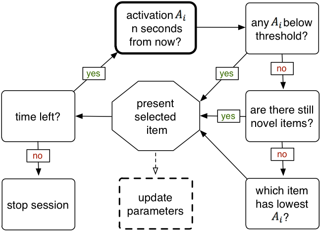

```{r load required packages, message=FALSE}
library(Matrix)
library(Rcpp)
library(lme4)
library(BayesFactor)
library(vioplot)
library(zoo)
library(lmtest)
library(MASS)
```

# The study

## Download the paper

A link to the published paper (PDF) will be added as soon as it is available. 

## Abstract

> One of the goals of computerized tutoring systems is to optimize the learning of facts. Over a hundred years of memory research have identified two robust effects that can improve such systems: the spacing and the testing effect (Cepeda, Pashler, Vul, Wixted, & Rohrer, 2006; Roediger & Butler, 2011). By making optimal use of both and adjusting the system to the individual learner using cognitive models based on memory theories, such systems consistently outperform traditional methods (Van Rijn, Van Maanen & Van Woudenberg, 2009). This adjustment process is driven by a continuously updated estimate of the rate of forgetting for each item and learner on the basis of the learner's accuracy and response time. In this study, we investigated to what extent these estimates of individual rates of forgetting are stable over time and across different materials, and demonstrate that they are stable over time but not across materials. Even though most theories of human memory assume a single underlying rate of forgetting, we show that, in practice, it makes sense to assume different materials are forgotten at different rates. If a computerized, adaptive fact-learning systems would allow for different rates of forgetting for different materials, it could adapt to individual learners more readily.  

# Data

## Description of (data) files

All data is located in the `data/` folder.

* The raw data for each participant for the learning session has been downloaded from the server and merged into a single file. This is also where the **exclusion criteria** were applied. The process is documented in `merge_model_data.html`.

* The participants that fulfilled the exclusion criteria were saved in `whitelist.txt` so that all other files can cross-reference a single file to check whether participants should be included.

* The data for the tests at the end of each block were collected through Google Forms and were exported to individual `.csv` files that can be found in the `/data` folder. Pre-processing consisted of changing the column names and filtering out participants that did not fulfill the exclusion criteria. The files have the prefix `TEST_*`.

* Demographic information was also collected via a Google Form and exported as `demographics.csv` file.

* Mean alpha values were computed for each participant. The means are based on the final alpha values for all items that have been encountered at least three times during the study session. The mean was aggregated across all items to yield one alpha value (i.e., rate of forgetting) per participant. These values are stored for easy access in `mean_alphas.txt`.

* To make the regression analyses easier, I compiled `data_for_Friederike.csv` which contains the alpha value for each item for each participants. Three additional columns contain information about the *block*, which *session* the block was performed in (i.e., on which day), and what type of material was studied (there were four types: Swahili, flags, maps, and biopsychology facts, coded 1 through 4).

Additionally, the `misc/` folder contains:

* A two-line script that determines the labels used for the blocks and their corresponding colors: `block_colors.R`.

* The files OmniGraffle files to create Figures 1 and 2 as well as the exported .png files that are in the paper.

## Reading in the data

The data is distributed across multiple files and this is a bit messy.

```{r reading in the data}
whitelist <- read.table('data/whitelist.txt')[, 1]

# Read in the demographic information:
demo <- read.csv("data/demographics.csv", header=TRUE, stringsAsFactors=FALSE)
names(demo) <- c('timestamp', 'age', 'nationality', 'gender', 'subj', 'america', 'language')
n.before <- length(demo$subj[demo$subj > 60000])
demo <- demo[which(demo$subj %in% whitelist), ]

# Read in the data:
data <- read.csv("data/MODEL_data.csv", stringsAsFactors=FALSE)

# Read in the test data:
# Make sure to replace spaces with periods. The column names contain periods instead of spaces 
# and those are used as a reference to determine whether something is spelled correctly!
vocab1 <- read.csv('data/TEST_vocab1.csv', stringsAsFactors=FALSE)
vocab2 <- read.csv('data/TEST_vocab2.csv', stringsAsFactors=FALSE)
vocab3 <- read.csv('data/TEST_vocab.csv', stringsAsFactors=FALSE)
flags <- read.csv('data/TEST_flags.csv', stringsAsFactors=FALSE)
flags <- lapply(flags, function(X) sub(" ", ".", X))
flags$subj <- as.numeric(flags$subj)
flags <- as.data.frame(flags, stringsAsFactors = FALSE)
maps <- read.csv('data/TEST_maps.csv', stringsAsFactors=FALSE)
maps <- lapply(maps, function(X) sub(" ", ".", X))
maps$subj <- as.numeric(maps$subj)
maps <- as.data.frame(maps, stringsAsFactors = FALSE)
biopsych <- read.csv('data/TEST_biopsych.csv', stringsAsFactors=FALSE)

# store the correct responses from the file's headers:
correct <- cbind(names(vocab1), names(vocab2), names(vocab3), names(flags), names(maps), names(biopsych))[3:27, ]

# replace header so `col.names` are the same and `rbind` doesn't complain:
header <- c('timestamp', 'subj', paste('item', 1:25, sep=''), 'block')
names(vocab1) <- names(vocab2) <- names(vocab3) <- names(flags) <- names(maps) <- names(biopsych) <- header

test <- rbind(vocab1, vocab2, vocab3, flags, maps, biopsych)
 # the header names contain periods instead of spaces and those are used as a reference to figure out whether an answer is correct or not.

# Read in data for Friederike's analyses:
data.fr <- read.csv("data/data_for_Friederike.csv")

# Misc:
source("misc/block_colors.R") # load the colors and the labels for the blocks
```

## Demographic information

`r n.before` participants showed up for the first session. After the exclusion criteria were applied, `r length(whitelist)` participants remained in the data set. 

### Gender

There are `r length(unique(demo$subj))` participants in the data set of which `r sum(demo$gender == 'male')` are male and `r sum(demo$gender == 'female')` are female. The median age is `r median(demo$age)`, with ages between `r range(demo$age)` and a standard deviation of `r round(sd(demo$age), 2)`.


### Age

```{r demo:age}
hist(demo$age, main='Distribution of Participants\' Ages', xlab='Age')
abline(v=median(demo$age), col="red", lwd=2)
```


### Nationality

The nationalities are distributed as follows:
```{r demo:nationality}
pie(table(demo$nationality), main="What is your nationality?")
```

With the biggest group being Germans (`r round(sum(demo$nationality == 'German')/length(demo$nationality) * 100, 1)`%), followed by Dutch citizen (`r round(sum(demo$nationality == 'Dutch')/length(demo$nationality) * 100, 1)`%).


### America

We asked them whether they've been to America before to make sure they don't have too much knowledge about the country so we can assume they have no prior knowledge in the `maps` condition. In retrospect, that probably doesn't really  matter because the cities are obscure enough and it shouldn't matter even if they happen to know one of them. Here's the distribution of the answers, though:

```{r demo:america}
pie(table(demo$america), main='Have you ever been to the USA?')
```

# Figures from the paper

## Figure 1: Overview of the experimental design

This figure was created in `OmniGraffle Professional` and the file `study_design.graffle` is located in the `/misc` folder.



## Figure 2: A graphical representation of the algorithm

This figure was created in `OmniGraffle Professional` and the file `flowchart_algorithm_v2.graffle` is located in the `/misc` folder.



## Figure 3: Violin plot of test performance

The proportion correct for each block is computed and the corresponding "violin" is added to the plot:

```{r violin plot of test performance}
par(las=1, bty='n')
plot(NA, xlim=c(.5, 6.5), ylim=c(.2, 1), axes=F, xlab='', ylab='proportion correct')
axis(1, 1:6, blocks)
axis(2, seq(.2, 1, .1))
title('Percentage Correct on Final Test')

tmp <- apply(vocab1[, 3:27], 1, function(X) mean(tolower(X) == correct[, 1]))
vioplot(tmp, at=1, col=paste(block.col[1], '88', sep=''), add=TRUE, border=NA)
tmp <- apply(vocab2[, 3:27], 1, function(X) mean(tolower(X) == correct[, 2]))
vioplot(tmp, at=2, col=paste(block.col[2], '88', sep=''), add=TRUE, border=NA)
tmp <- apply(vocab3[, 3:27], 1, function(X) mean(tolower(X) == correct[, 3]))
vioplot(tmp, at=3, col=paste(block.col[3], '88', sep=''), add=TRUE, border=NA)
tmp <- apply(flags[, 3:27], 1, function(X) mean(tolower(X) == correct[, 4]))
vioplot(tmp, at=4, col=paste(block.col[4], '88', sep=''), add=TRUE, border=NA)
tmp <- apply(maps[, 3:27], 1, function(X) mean(tolower(X) == correct[, 5]))
vioplot(tmp, at=5, col=paste(block.col[5], '88', sep=''), add=TRUE, border=NA)
tmp <- apply(biopsych[, 3:27], 1, function(X) mean(tolower(X) == correct[, 6]))
vioplot(tmp, at=6, col=paste(block.col[6], '88', sep=''), add=TRUE, border=NA)
```

## Figure 4: Alpha-test relationship

The function to plot the data:

```{r, echo=FALSE}
plot.alpha.test <- function(test, A, use.bins=TRUE, n.bin=5) {
  
  point.pch <- 19
  line.col <- rgb(0, 0, 0, .3)
  
  par(las=1)
  plot(NA, xlim=range(A), ylim=c(.2, 1.05), axes=F, xlab='mean(alpha || rate of forgetting)', ylab='% correct on test', main=paste('Alpha-Test Relationship (N = ', nrow(A), ')', sep=''))
  axis(1, round(seq(min(A), max(A), .05), 2))
  axis(2, seq(.2, 1, .1))
  abline(v=.3, lty=2, col=line.col) # the default alpha

  mtext(ifelse(use.bins, paste('[using', n.bin, 'bins]'), '[all data points]' ), 3)
  
  for(b in 1:length(blocks)) {
    t <- test[test$block == blocks[b], ]

    # make sure the order of `t` and `A` match:
    t <- t[match(row.names(A), t$subj), 3:27] # exclude excess columns
    row.names(t) <- row.names(A)
    
    # x-values:
    alphas <- A[, b]
    alphas <- alphas[order(alphas)]  # order them so bins can be made
    
    # y-values:
    Y <- apply(t, 1, function(X) sum(tolower(X) == correct[, b])) / nrow(correct) # make proportion
    
    if(use.bins) {
      # To make bins, convert vector to matrix with ncol=n.bin and then compute colMeans()
      # For this to work, length(vector) % n.bin must be 0. If not the case, add NA's to the end
      if( (length(Y) %% n.bin) != 0 ) {
        nas <- rep( NA, n.bin - (length(Y) %% n.bin) )
        alphas <- c(alphas, nas)
        Y <- c(Y, nas)
      }
      
      # Compute bin means:
      alphas <- colMeans(matrix(alphas, ncol=n.bin), na.rm=TRUE)
      Y <- colMeans(matrix(Y, ncol=n.bin), na.rm=TRUE)
      
      # Add to the plot:
      lines(alphas, Y, col=line.col)
      points(alphas, Y, col=paste(block.col[b], 'AA', sep=''), pch=point.pch, cex=1.2)
      points(alphas, Y, col='white', pch=paste(1:length(Y)), cex=.5)
      } 
    else {
      # no bins; plot all data points:
      points(alphas, Y, col=paste(block.col[b], '66', sep=''), pch=point.pch) # make them semi-transparent
      }
    }
  if( (nrow(A) %% n.bin) != 0 & use.bins ) {
    warning(paste("N =", nrow(A), "which is not a multiple of bin size", n.bin, "-- therefore", length(nas), "NAs have been added to the last bin."))
    }
  
  legend('bottomleft', legend=blocks, col=block.col, pch=point.pch, bty='n')
}
```

This function can be used to create plots with varying numbers of bin sizes (or no bins). In the paper, a bin size of 5 was used because it is a good trade-off between preserving the information in the data and providing good readability.

```{r multiple bin sizes, fig.width=10, fig.height=10}
A <- read.table("data/mean_alphas.txt")

par(mfrow=c(2,2))
plot.alpha.test(test, A, use.bins=FALSE)
for(i in c(3, 5, 7)) plot.alpha.test(test, A, n.bin=i)
```

## Figure 5: Mean rate of forgetting per participant per condition

Another violin plot, showing estimated rate of forgetting per participant for each of the six conditions.

```{r mean ROF per pp per block}
d <- aggregate(alpha ~ block + subj, data.fr, mean)

par(las=1, bty='n')
ylim <- c(.1, .5)
plot(NA, xlim=c(.5, 6.5), ylim=ylim, axes=FALSE, xlab='', ylab='estimated rate of forgetting')

for(i in 1:length(blocks)) {
  vioplot(d$alpha[d$block == blocks[i]], at=i, col=paste(block.col[i], 'CC', sep=''), add=TRUE, border=NA)
}

axis(1, 1:length(blocks), blocks)
axis(2, seq(ylim[1], ylim[2], .05))  # adjust manually
```

# Analyses

## Correlations

The correlations were computed for all combinations of blocks:

```{r correlations, echo=FALSE}
for(i in 2:6) {
  print('-----')
  for(j in 1:6) {
    if(i <= j) next #iteration
    tmp <- cor.test(A[, i], A[, j])
    print(paste('r = ', round(tmp$estimate, 3), ' with p >= ', round(tmp$p.value, 4), ' for cor(', blocks[i], ', ', blocks[j], ')', sep=''))
  }
}
```

The *p*-values are all tiny and all correlations differ significantly from 0.


## Dummy-coded linear mixed-effects model

This analysis was conducted by **Friederike Behrens**.

```{r lmer}
alphadata <- read.table("data/data_for_Friederike.csv", sep=",", header=TRUE)
attach(alphadata)
boxplot(alpha ~ subj) 
boxplot(alpha ~ item) 
```

Great variation between subjects and great variation between items. Both boxplots justify the use of subject and item as random effects (allow for different intercepts per subject and item).

In order to give the interpretation of the regression model a meaningful interpretation, the variables `type` and `session` are recoded from having values from 1-3/4 to values 0-2/3. 

```{r dummy coding}
sessioncen <- session-1  # centered; make zero meaningful for regression

## dummy coding
# swyn= dummy code with sw= 0 and other tasks(notsw)=1
swyn <- as.numeric( !(type == 1) )
# flci= dummy code with flags= -0.5 and city= 0.5
flci <- 1:length(block) * 0  # all 0's
flci[which(block == 'flags')] <- -.5  # replace at index of "flags"
flci[which(block == 'maps')] <- .5    # replace at index of "maps"/city
```

Fit the first model:

```{r first model}
first <- lmer(alpha ~ session*swyn + session*flci + (1|subj) + (1|item))

# checking assumtpions:
par(mfrow=c(1, 2))
plot(fitted(first),residuals(first))
abline(a=0, b=0)
qqnorm(residuals(first)); qqline(residuals(first))
```

The assumption of linearity is met, because no pattern or shape of a specific non-linear distribution is evident. The assumption of homoscedasticity might be considered violated: the variance for smaller predicted values is smaller compared to the variance for bigger values. Also, the assumption of normality is violated given the big deviations in the qq-plot from the reference line.

One possibility is to log-transform the data:

```{r log transform}
alphalog <- log(alpha)
firstlog <- lmer(alphalog ~ type*session + (1|subj) + (1|item))
par(mfrow=c(1, 2))
plot(fitted(firstlog),residuals(firstlog))
abline(a=0, b=0)
qqnorm(residuals(firstlog)); qqline(residuals(firstlog))
```

Both the heteroscedasticity and non-normality is reduced by using the log-transformation of the alpha variable. Consequently, the analysis is conducted using the transformation. Having checked the assumption for using a linear mixed-effects model regression, we can precede with interpreting the proposed model.

```{r interpreting the model}
summary(firstlog)
```


### Post-hoc t-tests

The analysis revealed that there is a difference between Swahili and non-Swahili conditions (i.e., a sig. effect of `type`). Post-hoc t-tests were performed to check which conditions differ. These basically test the differences between pairs of violins in Figure 5. Since these are post-hoc tests, the critical alpha level should be Bonferroni-correct: alpha is not .05 but .05/6 = .0083.

```{r post-hoc t-tests}
t.test(d$alpha[d$block == "vocab1"], d$alpha[d$block == "vocab2"], paired = TRUE)
t.test(d$alpha[d$block == "vocab1"], d$alpha[d$block == "vocab3"], paired = TRUE)
t.test(d$alpha[d$block == "vocab2"], d$alpha[d$block == "vocab3"], paired = TRUE)
t.test(d$alpha[d$block == "flags"], d$alpha[d$block == "maps"], paired = TRUE)
t.test(d$alpha[d$block == "flags"], d$alpha[d$block == "biopsych"], paired = TRUE)
t.test(d$alpha[d$block == "biopsych"], d$alpha[d$block == "maps"], paired = TRUE)
```

Additionally, Bayes factor t-tests were performed to see whether the data supports the *equality* of some of the conditions:

```{r BF t-tests}
ttestBF(d$alpha[d$block == "vocab1"], d$alpha[d$block == "vocab2"], paired = TRUE) # ~ 18
ttestBF(d$alpha[d$block == "vocab1"], d$alpha[d$block == "vocab3"], paired = TRUE) # ~ 90
ttestBF(d$alpha[d$block == "vocab2"], d$alpha[d$block == "vocab3"], paired = TRUE) # 1/BF = ~6.4
ttestBF(d$alpha[d$block == "flags"], d$alpha[d$block == "maps"], paired = TRUE) # 1.8 * 10^15
ttestBF(d$alpha[d$block == "flags"], d$alpha[d$block == "biopsych"], paired = TRUE) # 1/BF = 7.2
ttestBF(d$alpha[d$block == "biopsych"], d$alpha[d$block == "maps"], paired = TRUE) # 1.23 * 10^13
```


## Backwards regression

This analysis was conducted by **Friederike Behrens**.

The aim of the second analysis is to investigate the predictive power of the forgetting rate based on alpha scores of previous session that consisted of the same or a different task. To do that, the means are calculated for each subject per block (condition).

```{r}
alpha_sw1 <- tapply(alpha[block=="vocab1"], subj[block=="vocab1"], mean)
alpha_sw2 <- tapply(alpha[block=="vocab2"], subj[block=="vocab2"], mean)
alpha_sw3 <- tapply(alpha[block=="vocab3"], subj[block=="vocab3"], mean)
alpha_fl <- tapply(alpha[block=="flags"], subj[block=="flags"], mean)
alpha_ci <- tapply(alpha[block=="maps"], subj[block=="maps"], mean)
```

Next, a backward stepwise regression analysis is conducted. 

```{r}
modelstep <- lm(alpha_sw3 ~ alpha_sw2 + alpha_sw1 + alpha_ci + alpha_fl, data=alphadata)
step <- stepAIC(modelstep, direction="backward")
step$anova
```

The ad-hoc hypothesis was that the same and more recent tasks would have more predictive power than another and earlier tasks. Both claims are confirmed by the stewise regression analysis. Only the alpha scores of the same (swahili) task explained a significant proportion of the variance in the alpha scores of the third session of the swahili condition. The tasks of another domain, the flag and city tasks, could not contribute to a better model fit. Moreover, the performance of the more recent swahili task is a stronger predictor than the performance during the first (and therefore earlier) session. This is indicated by the smaller AIC value for the former factor (475.78 versus 506.90), as a smaller AIC indicates a better model fit. Looking at the final model further supports greater contribution of the second compared to the first session indicated by a greater coefficient estimate (0.636 versus 0.244).

```{r}
finalmodel <- lm(alpha_sw3 ~ alpha_sw2 + alpha_sw1, data=alphadata)
```

As a last step, the assumptions for the final model are checked. 

```{r}
par(mfrow=c(2,2))
plot(finalmodel)
```

The residuals nicely follow the reference line in the Q-Q plot suggesting a normal distribution of the residuals. Furthermore, the residuals-versus-predicted values plot does not show a clustering or a non-linear shape of the residuals which indicates that the assumptions of homoscedasticity and linearity of residuals are met. Moreover, the residuals-versus-leverage plot does not reveal any particularly influential values.

Taken all together, the stepwise hierarchical regression suggest that the third session of the swahili task can best be predicted by the two preceding sessions of the same task, but not based on tasks from other domains. The total proportion of the variance of the third session of the swahili explained by this model is 77.68% (76.99% adjusted R^2). The final model is as follows:

> alpha(sw3)= 0.026 + 0.636 * alpha(sw2) + 0.244 * alpha(sw1)